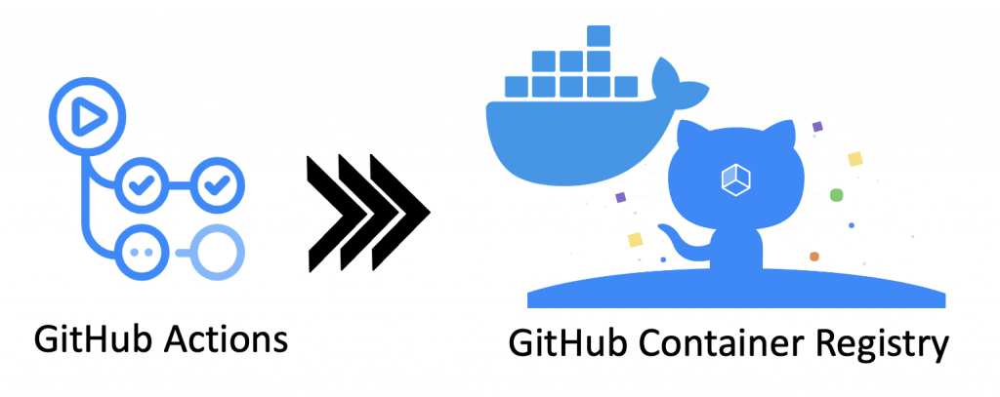

<h1 align="center">
  </img>
  <br>
  <b>[Guide] Dockerize Github Projects </b>
</h1>

<p align="center">Containerize code repository using Docker to simplify deployment, improve portability, and streamline development workflows.</p>

<!-- Badges -->
<p align="center">
  <a href="https://github.com/QuanBlue/Dockerize-Github-Projects/graphs/contributors">
    
  </a>
  <a href="">
    
  </a>
  <a href="https://github.com/QuanBlue/Dockerize-Github-Projects/network/members">
    
  </a>
  <a href="https://github.com/QuanBlue/Dockerize-Github-Projects/stargazers">
    
  </a>
  <a href="https://github.com/QuanBlue/Dockerize-Github-Projects/issues/">
    
  </a>
  <a href="https://github.com/QuanBlue/Dockerize-Github-Projects/blob/main/LICENSE">
    
  </a>
</p>

<p align="center">
  <b>
      <a href="https://github.com/QuanBlue/Dockerize-Github-Projects">Documentation</a> •
      <a href="https://github.com/QuanBlue/Dockerize-Github-Projects/issues/">Report Bug</a> •
      <a href="https://github.com/QuanBlue/Dockerize-Github-Projects/issues/">Request Feature</a>
  </b>
</p>

<br/>



<br/>

<details open>
<summary><b>📖 Table of Contents</b></summary>

-  [Getting Started](#toolbox-getting-started)
   -  [Prerequisites](#pushpin-prerequisites)
-  [Dockerize Github Projects](#whale-dockerize-github-projects)
   -  [Way 1: Push Docker images manually](#one-way-1-push-docker-images-manually)
      -  [Create Image](#create-image)
         -  [Create a Dockerfile](#create-a-dockerfile)
         -  [Build the image](#build-the-image)
      -  [Push Image to Github Packages (GHCR)](#push-image-to-github-packages-ghcr)
      -  [Setting Package](#setting-package)
   -  [Way 2: Automate Build and Push images via a Github Actions workflow](#two-way-2-automate-build-and-push-images-via-a-github-actions-workflow)
      -  [Create a Dockerfile](#create-a-dockerfile-1)
      -  [Create a Workflow file](#create-a-workflow-file)
-  [Practice](#weight_lifting_man-practice)
-  [Roadmap](#world_map-roadmap)
-  [Contributors](#busts_in_silhouette-contributors)
-  [Credits](#sparkles-credits)
-  [License](#scroll-license)
-  [Related Projects](#link-related-projects)
</details>

# :toolbox: Getting Started

## :pushpin: Prerequisites

Before proceeding, make sure you have the following prerequisites installed:

-  Docker: [Install Docker](https://docs.docker.com/get-docker/)
-  Git: [Install Git](https://git-scm.com/book/en/v2/Getting-Started-Installing-Git)

-  Login to `GitHub Container Registry (GHCR)`

   -  Create `Personal Access Token (PAT)` with the `write:packages` and `delete:packages` scopes.

      > For more information, see "[Creating a personal access token](https://docs.github.com/en/github/authenticating-to-github/creating-a-personal-access-token)"

   -  Login to GHCR

      ```sh
      # Export PAT
      export CR_PAT=<personal-access-token>

      # Login to GHCR
      echo $CR_PAT | docker login ghcr.io -u <username> --password-stdin
      ```

# :whale: Dockerize Github Projects

## :one: Way 1: Push Docker images manually

### Create Image

#### Create a Dockerfile

Create a `Dockerfile` in the root directory of your project. The `Dockerfile` contains instructions for building a Docker image.

Here's a simple example:

```Dockerfile
FROM alpine
CMD [ "echo" "Dockerize your Github project"]
```

#### Build the image

Build the Docker image using the `docker build command. Run the following command from the project's root directory:

```sh
docker build -t ghcr.io/<username>/<repository>:<tag> .
```

### Push Image to Github Packages (GHCR)

```sh
# Tag the image
docker tag <local-image> ghcr.io/<username>/<repository>:<tag>

# Push the image
docker push ghcr.io/<username>/<repository>:<tag>
```

### Setting Package

-  Public package
-  Connect package to Github Repository
-  Add collaborators
-  Add README instruction

## :two: Way 2: Automate Build and Push images via a Github Actions workflow

### Create a Dockerfile

Follow the steps in [Create a Dockerfile](#create-a-dockerfile) to create a Dockerfile in the root directory of your project.

### Create a Workflow file

Create a workflow file (e.g. `build.yml`) in the `.github/workflows` directory.

Using this template to create a workflow file:

```yml
# .github/workflows/docker-publish.yml
name: Create and publish Docker image/package

on:
   push:
      branches: [main]
   pull_request:
      branches: [main]

env:
   REGISTRY: ghcr.io
   IMAGE_NAME: ${{ github.repository }}

jobs:
   build:
      runs-on: ubuntu-latest
      permissions:
         contents: read
         packages: write

      steps:
         - name: Checkout repository
           uses: actions/checkout@v3

         - name: Log in to the Container registry ${{ env.REGISTRY }}
           if: github.event_name != 'pull_request'
           uses: docker/login-action@f054a8b539a109f9f41c372932f1ae047eff08c9
           with:
              registry: ${{ env.REGISTRY }}
              username: ${{ github.actor }}
              password: ${{ secrets.GITHUB_TOKEN }}

         - name: Extract Docker metadata (tags, labels)
           id: meta
           uses: docker/metadata-action@98669ae865ea3cffbcbaa878cf57c20bbf1c6c38
           with:
              images: ${{ env.REGISTRY }}/${{ env.IMAGE_NAME }}
              tags: |
                 type=ref,event=branch

         - name: Build and push Docker image
           uses: docker/build-push-action@ad44023a93711e3deb337508980b4b5e9bcdc5dc
           with:
              context: .
              push: ${{ github.event_name != 'pull_request' }}
              tags: ${{ steps.meta.outputs.tags }}
              labels: ${{ steps.meta.outputs.labels }}
```

After push, the workflow will be triggered and the image will be built and pushed to the GHCR.

> **Note:**
>
> -  Check this repo Actions [here](https://github.com/QuanBlue/Dockerize-Github-Projects/actions)
> -  See this workflow file in detail (with explain) [here](./.github/workflows/docker-publish.yml)
> -  For detail instruction, see "[Github-Actions-cheatsheet](https://github.com/QuanBlue/Github-Actions-cheatsheet)"

# :weight_lifting_man: Practice

<details>
<summary>
  <b>Way 1:</b>  Push Docker images manually
</summary>

```sh
# build
➜ docker build -t ghcr.io/quanblue/dockerize-github-projects:manually .
[+] Building 25.9s (5/5) FINISHED
 => [internal] load build definition from Dockerfile                       0.1s
 => => transferring dockerfile: 94B                                        0.0s
 => [internal] load .dockerignore                                          0.1s
 => => transferring context: 2B                                            0.0s
 => [internal] load metadata for docker.io/library/alpine:latest           3.6s
 => [1/1] FROM docker.io/library/alpine@sha256:02bb6f428431fbc2809c5d1b4  22.1s
 => => resolve docker.io/library/alpine@sha256:02bb6f428431fbc2809c5d1b41  0.0s
 => => sha256:02bb6f428431fbc2809c5d1b41eab5a68350194fb50 1.64kB / 1.64kB  0.0s
 => => sha256:c0669ef34cdc14332c0f1ab0c2c01acb91d96014b172f1a 528B / 528B  0.0s
 => => sha256:5e2b554c1c45d22c9d1aa836828828e320a26011b76 1.47kB / 1.47kB  0.0s
 => => sha256:8a49fdb3b6a5ff2bd8ec6a86c05b2922a0f7454579 3.40MB / 3.40MB  21.9s
 => => extracting sha256:8a49fdb3b6a5ff2bd8ec6a86c05b2922a0f7454579ecc076  0.1s
 => exporting to image                                                     0.0s
 => => exporting layers                                                    0.0s
 => => writing image sha256:bfd7d991fec0ee73856a73d220f0addb54e94218f14a6  0.0s
 => => naming to ghcr.io/quanblue/dockerize-github-projects:manually        0.0s

# push
➜ docker push ghcr.io/quanblue/dockerize-github-projects:manually
The push refers to repository [ghcr.io/quanblue/dockerize-github-projects]
bb01bd7e32b5: Pushed
manually: digest: sha256:b6cf8bb5fe8270c5f1e39f124f8b5970e15ec9937a65367198b674a8317636e0 size: 527
```

</details>

<details>
<summary>
  <b>Way 2:</b> Automate Build and Push images via a Github Actions workflow
</summary>

When you push to the `main` branch, the workflow will be triggered and build and push the image to the Github Container Registry.

</details>

<br/>

Check Github packages: of this repo [here](https://github.com/QuanBlue/Dockerize-Github-Projects/pkgs/container/dockerize-github-projects)

<div align="center">


<i>Figure 1. dockerize-github-project package</i>

</div>

-  Container with tag `manually` is pushed manually
-  Container with tag `main` is pushed via Github Actions workflow

# :world_map: Roadmap

-  [x] Dockerize Github Projects
   -  [x] Manual
   -  [x] Using Github Actions
-  [x] Emoji

# :busts_in_silhouette: Contributors

<a href="https://github.com/QuanBlue/Dockerize-Github-Projects/graphs/contributors">
  
</a>

Contributions are always welcome!

# :sparkles: Credits

This software uses the following open source packages:

-  [Docker](https://www.docker.com/)
-  [Github](https://github.com/)
-  Emojis are taken from [here](https://github.com/arvida/emoji-cheat-sheet.com)

# :scroll: License

Distributed under the MIT License. See <a href="./LICENSE">`LICENSE`</a> for more information.

# :link: Related Projects

-  <u>[**Github Actions cheatsheet**](https://github.com/QuanBlue/Github-Actions-cheatsheet)</u>: A cheat sheet for Github actions.

---

> Bento [@quanblue](https://bento.me/quanblue) &nbsp;&middot;&nbsp;
> GitHub [@QuanBlue](https://github.com/QuanBlue) &nbsp;&middot;&nbsp; Gmail quannguyenthanh558@gmail.com
